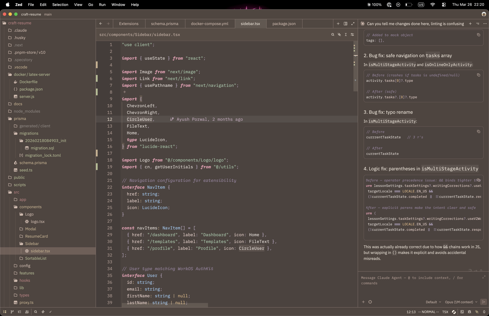
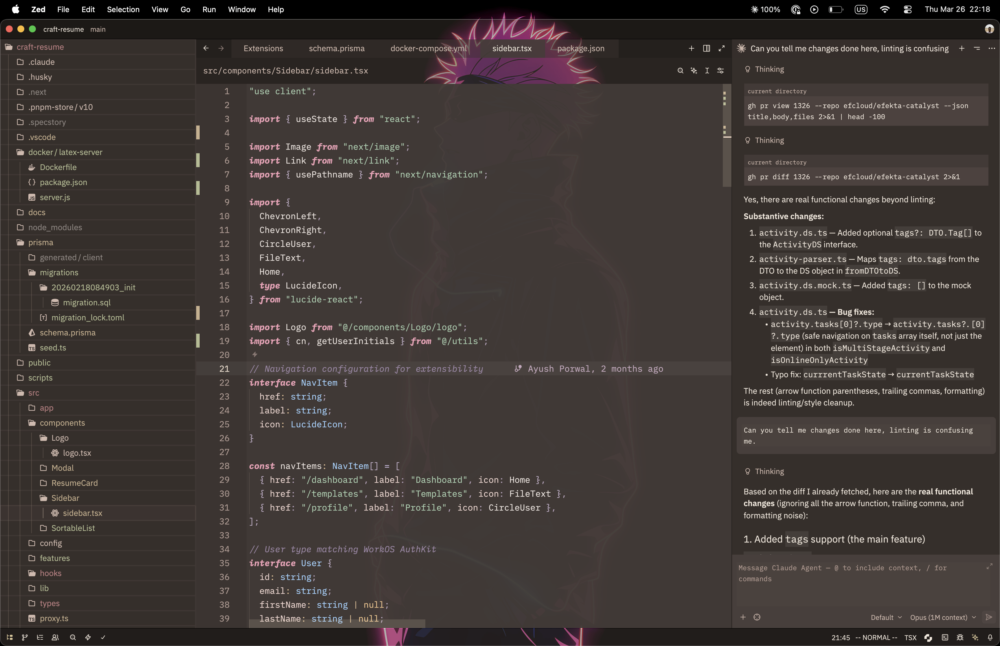

# Rosewood for Zed

Rosewood is a dark theme family for [Zed](https://zed.dev) with two distinct moods: the original warm `Dusk` pair and a colder, more experimental `Fathom` pair. It is designed to feel atmospheric without sacrificing readability, so long coding sessions stay calm instead of flat, gray, or harsh.



_Rosewood Dusk_



_Rosewood Dusk Transparent_

## Features

Rosewood is made for people who want a dark theme with character.

- **Two different dark moods instead of one safe default**
  - `Rosewood Dusk` keeps the family warm: layered browns, muted rose borders, olive-tinted neutrals, and soft ivory text.
  - `Rosewood Fathom` goes colder and stranger: mineral slate chrome, deep ink editor surfaces, brass accents, sea-glass highlights, and cooler diagnostics.

- **Readable pastel syntax**
  - Dusk leans into rose, sage, powder blue, and lavender.
  - Fathom swaps in coral keywords, seafoam strings, brass constants, sky-blue types, and violet hints.
  - Comments stay muted and italic in both branches, visible without stealing focus.

- **Transparent variants that still feel usable**
  - `Rosewood Dusk Transparent` keeps the same palette, but strips the chrome back so your wallpaper can become part of the experience.
  - `Rosewood Fathom Transparent` does the same for the cooler branch, keeping enough density in the editor while letting the outer chrome breathe.

- **UI, terminal, and diagnostics all match**
  - Each branch has its own matching terminal ANSI palette instead of feeling bolted on.
  - Git states, success colors, warnings, errors, hints, and collaboration cursors are tuned to fit each branch's visual language.

## Included Themes

- `Rosewood Dusk` for a warm, blurred dark workspace.
- `Rosewood Dusk Transparent` for a glassy setup with wallpaper showing through the editor chrome.
- `Rosewood Fathom` for a colder mineral-dark workspace with brass, sea-glass, and violet accents.
- `Rosewood Fathom Transparent` for the same palette with translucent chrome.

## VS Code

The repo now includes first-pass VS Code exports for all non-transparent variants under `vscode/themes/`.

It is generated from the Zed source theme with:

```bash
npm run build:vscode
```

The VS Code ports keep each source palette, syntax, diagnostics, and terminal colors aligned as closely as possible, but adapt Zed-only blur/transparency behavior into standard VS Code workbench colors.

### Test locally in VS Code

1. Open this repo in VS Code.
2. Press `F5` and choose **Run Rosewood Theme Extension**.
3. In the Extension Development Host window, open the theme picker and select any `Rosewood ...` theme.

### Package a local VSIX

If you want to install it like a normal VS Code extension:

```bash
npm install
npm run package:vscode
```

Then install the generated `.vsix` file from VS Code with **Extensions: Install from VSIX...**.

## Installation

### Install locally in Zed

1. Clone the repository:

   ```bash
   git clone https://github.com/ayush-porwal/zed-rosewood-theme.git
   ```

2. Open Zed.
3. Open the Extensions page with `Cmd+Shift+X` on macOS or `Ctrl+Shift+X` on Linux/Windows.
4. Click **Install Dev Extension**.
5. Select the cloned `zed-rosewood-theme` directory.

### Install from the extension registry

If Rosewood is published to the Zed extension registry, open the Extensions page and search for **Rosewood**.

## Activation

Once installed:

1. Open the theme selector with `Cmd+K Cmd+T` on macOS or `Ctrl+K Ctrl+T` on Linux/Windows.
2. Choose **Rosewood Dusk**, **Rosewood Dusk Transparent**, **Rosewood Fathom**, or **Rosewood Fathom Transparent**.

You can also switch themes from **Settings** → **Theme**.

## Why Rosewood

Rosewood is for people who like dark themes, but are tired of sterile monochrome palettes. It gives you two directions on purpose: one warm and tactile, one cooler and more cinematic, both with clear syntax separation and transparent variants that look intentional instead of gimmicky.

If you want Zed to feel a little more tactile, a little less sterile, and a lot more personal, Rosewood is the point.

## Feedback

The theme is still evolving, and colors are subject to change based on iteration and community feedback.

Issues, ideas, collaborations, and pull requests are welcome.

## License

See the [LICENSE](./LICENSE) file for details.
